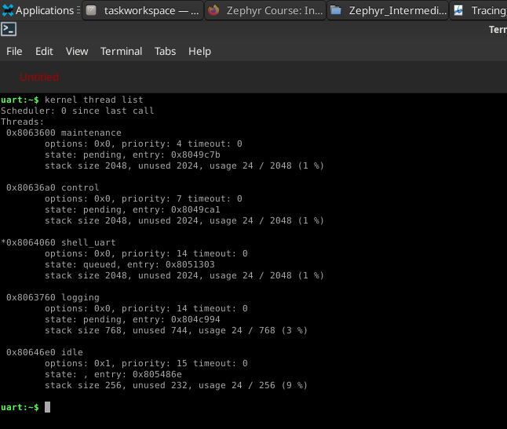

# Explain and reduce a Zephyr scheduling delay
## Run the provided producer-consumer application from branch l6-homework

The provided application was built and executed as is, building for native_sim. After running the application the following log was printed until it was stopped by calling CTLR+C:

```
uart connected to pseudotty: /dev/pts/3
*** Booting Zephyr OS build v4.4.0 ***
[00:00:00.000,000] <inf> homework: === L6 Homework: Runtime Investigation ===
[00:00:00.000,000] <inf> homework: Control work must start within 10 ms
[00:00:00.000,000] <inf> homework: Inspect, measure, trace, explain, and correct the delay
[00:00:00.545,000] <inf> homework: [CONTROL] processed seq=0
[00:00:00.795,000] <inf> homework: [CONTROL] processed seq=1
[00:00:01.045,000] <inf> homework: [CONTROL] processed seq=2
[00:00:01.295,000] <inf> homework: [CONTROL] processed seq=3
[00:00:01.545,000] <inf> homework: [CONTROL] processed seq=4
[00:00:01.795,000] <inf> homework: [CONTROL] processed seq=5
[00:00:02.045,000] <inf> homework: [CONTROL] processed seq=6
[00:00:02.295,000] <inf> homework: [CONTROL] processed seq=7
[00:00:02.545,000] <inf> homework: [CONTROL] processed seq=8
[00:00:02.795,000] <inf> homework: [CONTROL] processed seq=9
[00:00:03.045,000] <inf> homework: [CONTROL] processed seq=10
[00:00:03.295,000] <inf> homework: [CONTROL] processed seq=11
[00:00:03.545,000] <inf> homework: [CONTROL] processed seq=12
[00:00:03.795,000] <inf> homework: [CONTROL] processed seq=13
[00:00:04.045,000] <inf> homework: [CONTROL] processed seq=14
```

## Define and detect its response-time guarantee

There is a log message entry generated at the `main()` function which says that the control work must start within 10 ms. By looking at the log's timestamps the control thread is called for the first time after 545 ms. After the first 500 ms have passed, timer started in the `main()` expires and the callback function is called for the first time, adding a message to the queue. After this, the semaphore is given and the callback returns. At this point the maintenance thread is changed to the running state, as it has higher priority than the control thread. This maintenance thread adds a 45 ms blocking delay. Only after this 45 ms is that the maintenance thread goes back to waiting, allowing the control thread to run and dequeue the message. **The 45 ms delay imposed by the maintenance thread is what is making the response-time guarantee fail.**

## Add sequence-based logs and deadline-miss counting

A new message entry was added to the log, inside the timer callback, in order to identify when the event is was added to the queue. Also a deadline-miss counting log was added in the control thread. In order to rate limit this log message the configuration in prj.conf, CONFIG_LOG_RATELIMIT_INTERVAL_MS, was used.

After adding this 2 modifications the following log was printed:

```
uart connected to pseudotty: /dev/pts/2
*** Booting Zephyr OS build v4.4.0 ***
[00:00:00.000,000] <inf> homework: === L6 Homework: Runtime Investigation ===
[00:00:00.000,000] <inf> homework: Control work must start within 10 ms
[00:00:00.000,000] <inf> homework: Inspect, measure, trace, explain, and correct the delay
[00:00:00.500,000] <inf> homework: [PRODUCER] enqueued  seq=0
[00:00:00.545,000] <inf> homework: [CONTROL ] processed seq=0
[00:00:00.750,000] <inf> homework: [PRODUCER] enqueued  seq=1
[00:00:00.795,000] <inf> homework: [CONTROL ] processed seq=1
[00:00:01.000,000] <inf> homework: [PRODUCER] enqueued  seq=2
[00:00:01.045,000] <inf> homework: [CONTROL ] processed seq=2
[00:00:01.045,000] <wrn> homework: Skipped 2 messages
[00:00:01.045,000] <wrn> homework: deadline_miss count=3 seq=2 latency_ms=40
[00:00:01.250,000] <inf> homework: [PRODUCER] enqueued  seq=3
[00:00:01.295,000] <inf> homework: [CONTROL ] processed seq=3
[00:00:01.500,000] <inf> homework: [PRODUCER] enqueued  seq=4
[00:00:01.545,000] <inf> homework: [CONTROL ] processed seq=4
[00:00:01.750,000] <inf> homework: [PRODUCER] enqueued  seq=5
[00:00:01.795,000] <inf> homework: [CONTROL ] processed seq=5
[00:00:02.000,000] <inf> homework: [PRODUCER] enqueued  seq=6
[00:00:02.045,000] <inf> homework: [CONTROL ] processed seq=6
[00:00:02.045,000] <wrn> homework: Skipped 3 messages
[00:00:02.045,000] <wrn> homework: deadline_miss count=7 seq=6 latency_ms=40
[00:00:02.250,000] <inf> homework: [PRODUCER] enqueued  seq=7
[00:00:02.295,000] <inf> homework: [CONTROL ] processed seq=7
[00:00:02.500,000] <inf> homework: [PRODUCER] enqueued  seq=8
[00:00:02.545,000] <inf> homework: [CONTROL ] processed seq=8
[00:00:02.750,000] <inf> homework: [PRODUCER] enqueued  seq=9
[00:00:02.795,000] <inf> homework: [CONTROL ] processed seq=9
[00:00:03.000,000] <inf> homework: [PRODUCER] enqueued  seq=10
[00:00:03.045,000] <inf> homework: [CONTROL ] processed seq=10
[00:00:03.045,000] <wrn> homework: Skipped 3 messages
[00:00:03.045,000] <wrn> homework: deadline_miss count=11 seq=10 latency_ms=40
[00:00:03.250,000] <inf> homework: [PRODUCER] enqueued  seq=11
[00:00:03.295,000] <inf> homework: [CONTROL ] processed seq=11
```

## Inspect thread priorities and states with the kernel shell

The shell was already enabled in the prj.conf file, through `CONFIG_SHELL=y`. Also, a series of commands for the kernel are already enabled thanks to `CONFIG_KERNEL_SHELL=y`. Here is a screen capture of the shell's output when running `kernel thread list`:



The threads created for this application are shown, as well as some other threads such as a dedicated shell thread, a dedicated logging thread and the idle thread. The main thread does not appear because the `main()` function has already returned:

| Thread        | Priority | State   |
| ------------- |:--------:| -------:|
| maintenance   | 4        | pending |
| control       | 7        | pending |
| shell_uart    | 14       | queued  |
| logging       | 14       | pending |
| idle          | 15       | ,       |

## Capture CTF and decode it with Babeltrace

Two named trace events were added to the main.c, one at the end of the control thread and the other at the end of the timer callback function:
```c
// See main.c (line 53)
static void event_timer_expiry(struct k_timer *timer) {
    ...
    sys_trace_named_event("event_pushed", event.seq, event.ready_ms);
}
```
```c
// See main.c (line 91)
static void control_fn(void *p1, void *p2, void *p3) {
    ...
    sys_trace_named_event("event_processed", event.seq, latency_ms);
    ... 
}
```
In order to generate the trace file, first the metadata file was copied to a data folder. After this babeltrace was used (not babeltrace2) and the result was printed out to a text file "out", in order to better look at the trace:
```
$ source ../deps/zephyr/zephyr-env.sh
$ cp $ZEPHYR_BASE/subsys/tracing/ctf/tsdl/metadata data/
$ west build -p always -b native_sim app
$ ./build/zephyr/zephyr.exe -trace-file=data/channel0_0
$ babeltrace data/ > out
```

Here are 2 examples for the 2 named traces added for the task:
```
out (lines 307-320)
...
[21:00:00.500000000] (+0.010000000) 0 isr_enter:
[21:00:00.500000000] (+0.000000000) 0 timer_expiry_enter: { id = 134624492 }
[21:00:00.500000000] (+0.000000000) 0 msgq_put_enter: { id = 134624568, timeout = 0 }
[21:00:00.500000000] (+0.000000000) 0 thread_sched_ready: { thread_id = 134624928, name = "control" }
[21:00:00.500000000] (+0.000000000) 0 msgq_put_exit: { id = 134624568, timeout = 0, ret = 0 }
[21:00:00.500000000] (+0.000000000) 0 timer_start: { id = 134626336, duration = 1000000, period = 0 }
[21:00:00.500000000] (+0.000000000) 0 semaphore_give_enter: { id = 134624632 }
[21:00:00.500000000] (+0.000000000) 0 thread_sched_ready: { thread_id = 134624768, name = "maintenance" }
[21:00:00.500000000] (+0.000000000) 0 semaphore_give_exit: { id = 134624632 }
[21:00:00.500000000] (+0.000000000) 0 named_event: { name = "event_pushed", arg0 = 0, arg1 = 500 }
[21:00:00.500000000] (+0.000000000) 0 timer_expiry_exit: { id = 134624492 }
[21:00:00.500000000] (+0.000000000) 0 timer_expiry_enter: { id = 134628420 }
[21:00:00.500000000] (+0.000000000) 0 timer_expiry_exit: { id = 134628420 }
[21:00:00.500000000] (+0.000000000) 0 isr_exit:
...
```

```
out (lines 346-352)
...
[21:00:00.545000000] (+0.000000000) 0 thread_switched_in: { thread_id = 134624928, name = "control" }
[21:00:00.545000000] (+0.000000000) 0 msgq_get_exit: { id = 134624568, timeout = 4294957296, ret = 0 }
[21:00:00.545000000] (+0.000000000) 0 named_event: { name = "event_processed", arg0 = 0, arg1 = 40 }
[21:00:00.545000000] (+0.000000000) 0 msgq_get_enter: { id = 134624568, timeout = 4294957296 }
[21:00:00.545000000] (+0.000000000) 0 msgq_get_blocking: { id = 134624568, timeout = 4294957296 }
[21:00:00.545000000] (+0.000000000) 0 thread_sched_pend: { thread_id = 134624928, name = "control" }
[21:00:00.545000000] (+0.000000000) 0 thread_switched_out: { thread_id = 134624928, name = "control" }
...
```

In the first sample the trace start and ends with isr_enter: and isr_exit. This is the timer isr, which calls the timer's callback function `event_timer_expiry()`, which can also be seen in the trace. This trace shows how both threads, control and maintenance, get ready. After the msgq_put_enter entry, there is an entry showing that the control thread is now ready. This is because the control thread was on the waiting state beacuse of the call to `k_msgq_get()`. Then, after the semaphore_give_enter, the maintenance thread goes to ready. This is beacuse the maintenance thread was on the waiting state because of the call to `k_sem_give()`.

The second sample shows how the control thread enters the running state, dequeues an event from the msg queue and on the next iteration of the `while (true)` loop it enters the waiting state because the msg queue is empty.

## Apply one correction and repeat the measurement
