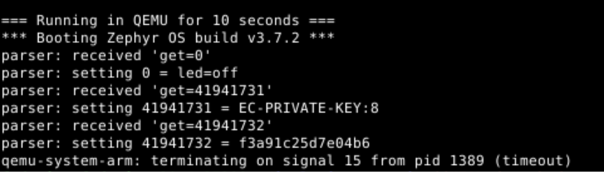
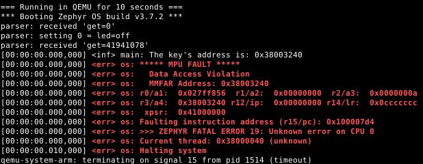

# Goal: Isolate your application

## Run the application, and observe the console output that leaks (intentionally) the Key

After following the instruction in the repository and running:

```
./run.sh
```

The console output printed the following messages, where the key is shown:


## Read the HOMEWORK_TASK.md doc to understand what you need to do, the point of the exercise, and some clear "tips"/"clues"

The setup of the problem is that our device can receive commands with the following format:

```
get=n
```

Where 'n' is the index of the setting someone is asking for. In `src/parser.c` there is an array called `settings` which stores every setting for our device:

```c
// See parser.c (line 7)
static const char settings[][SETTING_SIZE] __aligned(16) = {
	"led=off",
	"interval=10",
	"mode=auto",
};
```

The problem is that the parser does not validate if the 'n' from command `get=n` is valid or not, so passing any value greater than 2 allows anyone to read parts of the memory from other modules. For example, if the memory address of the `settings` array is 0x8010 and the memory address of the key is 0xA060, then reading index 517 will access the key:

| Variable | Address (example) |
| ------------- |:--------:|
| static const char settings[][SETTING_SIZE] __aligned(16) = { ... } | 0x8010 |
| static char device_key[32] __aligned(16) = ... | 0xA060 |

&(settings[0]) = 0x8010

&(settings[1]) = 0x8020
&(settings[2]) = 0x8030

...

&(settings[517]) = 0xA060 <-- this is the key's address

This address is what is calculated in the `attack_index` in the main.c:

```C
// See main.c line 39
long attack_index = ((const char *)credentials_key_addr() -
		     (const char *)parser_settings_addr()) / SETTING_SIZE;
```

By following the hints, the `parser_thread` handles untrusted data, that is, data comming from an external communication. The parser thread was configured in user mode, by enabling the `CONFIG_USERSPACE` in `prj.conf` and by passing the `K_USER` option when creating the thread:

```C
// See main.c line 42
k_thread_create(&parser_thread, parser_stack, PARSER_STACK_SIZE,
			parser_entry, (void *)attack_index, NULL, NULL,
			5, K_USER, K_NO_WAIT);
```

## Once you are done, you should be able to run the app again, and see how it now causes an MPU fault

Here is a screen capture after setting the thread in user mode:


The Zephyr documentation about User Mode says that (https://docs.zephyrproject.org/latest/kernel/usermode/overview.html):

```
A user thread may have read/write access to the stacks of other user threads in the same memory domain, depending on hardware.

    On MPU systems, threads may only access their own stack buffer.

    On MMU systems, threads may access any user thread stack in the same memory domain. Portable code should not assume this.
```

The Arm Cortex-M33 emulated here has an MPU, so when trying to read out of the `parser_thread`'s stack, an MPU fault is triggered.
